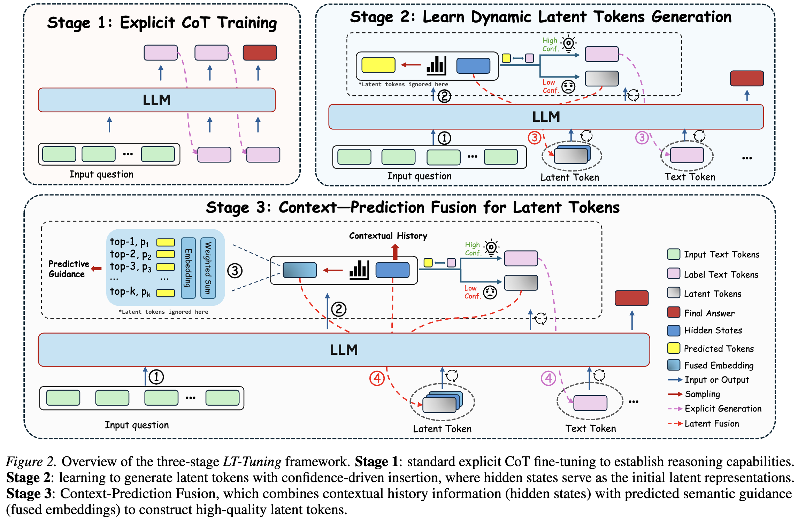

<div align="center">
    <h1 align="center"> Latent Thoughts Tuning: Bridging Context and Reasoning with Fused Information in Latent Tokens
    </h1>
</div>

<div align="center">

[](https://arxiv.org/abs/2602.10229)
[](LICENSE)
[](https://www.python.org/)
[](https://pytorch.org/)

[Paper](https://arxiv.org/abs/2602.10229) | [Code](https://github.com/NeosKnight233/Latent-Thoughts-Tuning)

</div>

---

## :sparkles: Overview

**Latent Thoughts Tuning** (**LT-Tuning**) is a post-training framework that enables LLMs to generate high-quality latent tokens for reasoning in continuous latent space without external assistant models. Instead of relying on a fixed number of latent tokens, our method allows models to dynamically interleave text and latent `<thinking>` tokens through **Confidence-driven Insertion** and **Context-Prediction Fusion**.

### :dart: Key Contributions

- **Context-Prediction Fusion** — Constructs latent tokens by fusing contextual hidden states with predictive semantic guidance from the vocabulary embedding space, mitigating feature collapse.
- **Confidence-Driven Dynamic Switching** — Adaptively decides when to engage latent reasoning vs. explicit text generation based on prediction confidence.
- **Three-Stage Curriculum Learning** — Progressively transitions from explicit CoT to latent reasoning for stable optimization.

## :building_construction: Method

<p align="center">
  
</p>

LT-Tuning uses a three-stage curriculum:

| Stage | Name | Description |
|:-----:|:-----|:------------|
| 1 | **Explicit CoT Warm-up** | Standard SFT on Chain-of-Thought data to build reasoning foundations |
| 2 | **Dynamic Latent Generation** | Confidence-driven `<thinking>` token insertion; hidden states as initial latent embeddings |
| 3 | **Context-Prediction Fusion** | Fuses contextual hidden states with probability-weighted vocabulary embeddings: `e_fusion = α · h_ctx + (1-α) · e_pred` |

---

## :rocket: Getting Started

### Prerequisites

- Python >= 3.9
- PyTorch >= 2.7
- CUDA 12.x with 4x NVIDIA A100 80GB (or equivalent)

### Installation

```bash
git clone https://github.com/NeosKnight233/Latent-Thoughts-Tuning.git
cd Latent-Thoughts-Tuning
pip install -r requirements.txt
```

### :file_folder: Data Preparation

Prepare JSONL training data with the following format:

```json
{"question": "...", "answer": "42", "reasoning_chain": "..."}
```

Place your data files in the `data/` directory and update paths in the config file.

### :gear: Configuration

All training hyperparameters are managed via a single YAML config file. See [`configs/example_config.yaml`](configs/example_config.yaml) for a full example.

Key parameters:

```yaml
# Model
model_name_or_path: meta-llama/Llama-3.2-1B

# Three-stage curriculum
stage_epochs: [1, 2, 7]          # epochs per stage
stage_modes: [common, hidden_state, soft_fusion]

# Confidence-driven insertion
thinking_strategy: confidence
reinforce_prob_threshold: [0.0, 0.3, 0.2]

# Context-Prediction Fusion
fusion_alpha: [0.5, 0.5, 0.6]   # weight for hidden state component
fusion_top_p: 0.9
fusion_temperature: 1.0
```

### :weight_lifting: Training

Launch multi-GPU training with DeepSpeed:

```bash
# Edit configs/example_config.yaml to set your model, data paths, and hyperparameters
bash scripts/train.sh
```

The training script (`run.py`) handles all three stages automatically via the `StageManager`. Stage transitions, dataset regeneration, and model config updates happen through callbacks — no manual intervention is needed.

<details>
<summary><b>Custom launch command</b></summary>

```bash
deepspeed --num_gpus 4 run.py configs/your_config.yaml
```

</details>

### :test_tube: Evaluation

Evaluate a trained model on all benchmarks (GSM8K-NL, ASDiv-Aug, MultiArith, SVAMP):

```bash
bash scripts/eval_LT_Tuning.sh
```

<details>
<summary><b>Custom evaluation</b></summary>

```bash
# Evaluate on specific datasets
torchrun --nproc_per_node=4 eval/eval_LT_Tuning.py configs/your_config.yaml \
    --datasets gsm8k asdiv multiarith svamp
```

</details>

---

## :open_file_folder: Project Structure

```
Latent-Thoughts-Tuning/
├── run.py                  # Main training entry point
├── model.py                # LT_Tuning_Model with fusion mechanism
├── dataset.py              # Data processing & thinking strategies
├── utils.py                # StageManager, Config, utilities
├── configs/
│   ├── example_config.yaml # Full training config template
│   └── ds_config_zero2.json# DeepSpeed ZeRO-2 config
├── scripts/
│   ├── train.sh            # Training launch script
│   └── eval_LT_Tuning.sh  # Evaluation launch script
├── eval/
│   ├── eval_LT_Tuning.py  # Multi-dataset evaluation
│   ├── dataset.py          # Benchmark data loading
│   └── utils.py            # Answer extraction & matching
└── data/                   # Training & evaluation data
```

---

## :page_facing_up: Citation

If you find this work useful, please cite our paper:

```bibtex
@article{liu2026latent,
  title={Latent Thoughts Tuning: Bridging Context and Reasoning with Fused Information in Latent Tokens},
  author={Liu, Weihao and Min, Dehai and Cheng, Lu},
  journal={arXiv preprint arXiv:2602.10229},
  year={2026}
}
```

## :balance_scale: License

This project is licensed under the [MIT License](LICENSE).
